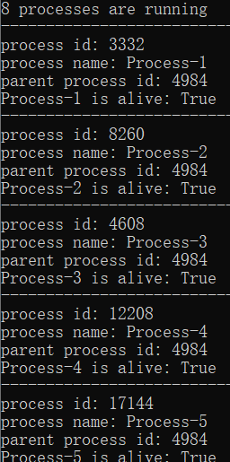
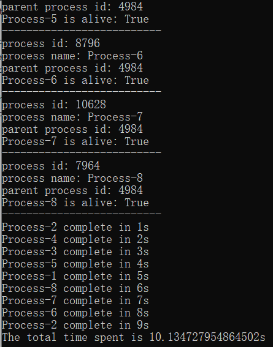
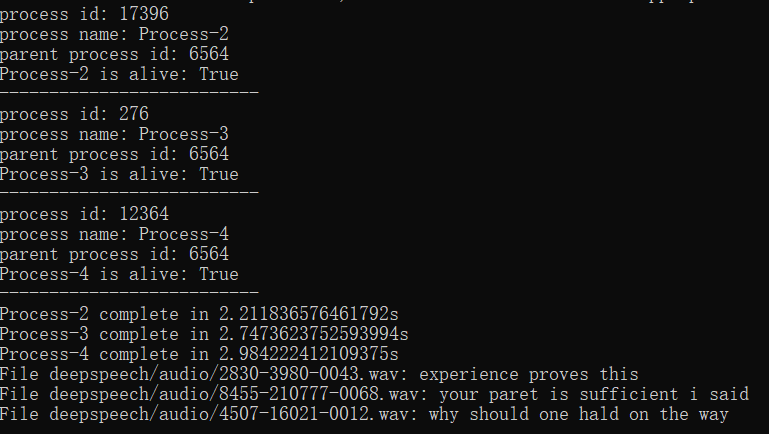

# EC530_Speech_to_Text
This project is a speech-to-text module that can handle requests from multiple users simultaneously to transfer speech (audio file) to text. It builds a queue system combined with multiprocessing to manage multiple requests.

## Phase1: Build Queue System
`Phase1` builds the queue system with multiprocessing but use stub function to test. The codes for `Phase1` lie in the file [queue_stub.py](./queue_stub.py). The requests to the stub function (function calls with different parameters) are put into the queue and multiple processes are started to consume the queue at the same time. 

Python module `multiprocessing` is used to control multiple processes. The queue system uses class `multiprocessing.Queue` in `multiprocessing` module instead of `queue.Queue` (which is a near clone but slightly different). I use `multiprocessing.cpu_count()` to find the number of processors which determines how many processes can be started and how many API calls can be handled simultaneously (on my computer it's 8).

The testing and tracking results are listed in the following. My computer can hold at most 8 processes running simultaneously. In the test I put 9 requests to the queue which lead to stub function costing 1 to 9 seconds to finish. In this condition all 8 processes can be used, so you can find 8 processes are running below and the specific infomation of each process is also shown.

After each process finishes its work, it will terminate and show how long it takes. The total time of finishing all requests is also shown. You can find it's much shorter than dealing with requests sequentially.

## Phase2: Speech to Text
`Phase2` mainly integrates a speech-to-text module to `Phase1` queue system. I choose to use [DeepSpeech](https://deepspeech.readthedocs.io/en/r0.9/) for speech-to-text processing, then replace the stub function by speech-to-text function. For testing I use three sample audio files DeepSpeech provides and put them into the queue. The translation results are shown below:

